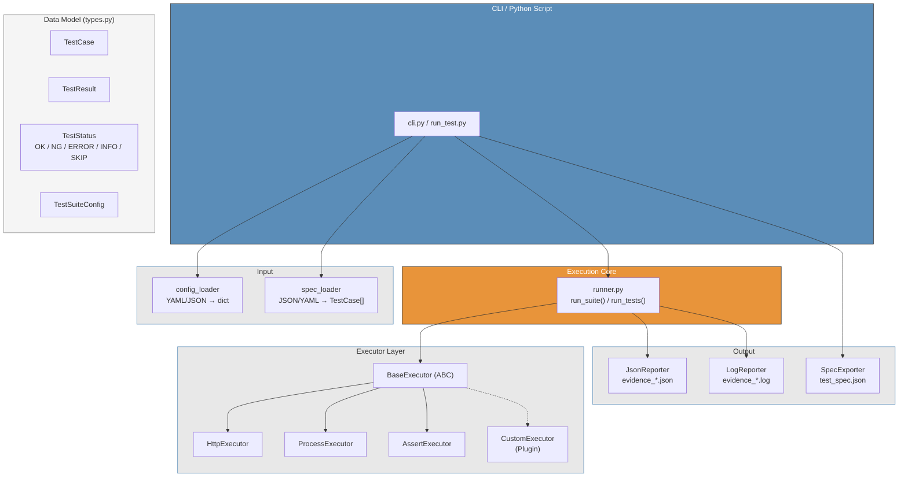
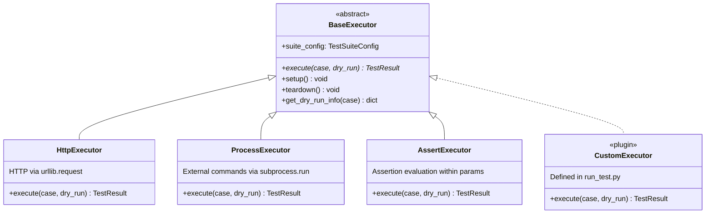
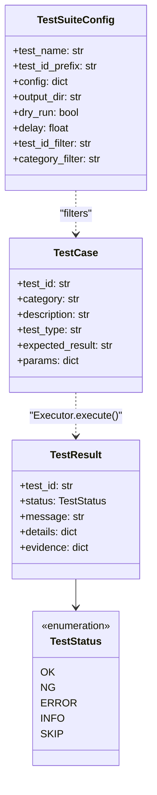

# Architecture

Package structure and internal design of gospelo-test-runner.

---

## Package Structure

```
gospelo_test_runner/
├── types.py            # TestCase, TestResult, TestSuiteConfig, TestStatus
├── cli.py              # CLI: run / version
├── runner.py           # Test execution orchestration
├── version.py          # Version info, artifact stamps
├── executor/           # Test execution engines (plugins)
│   ├── base.py         #   BaseExecutor (ABC)
│   ├── registry.py     #   entry_points plugin discovery
│   ├── http_executor.py    # HTTP request execution
│   ├── process_executor.py # Subprocess execution
│   └── assert_executor.py  # Assertion execution
├── loader/             # Input data loading
│   ├── config_loader.py    # YAML/JSON config files
│   └── spec_loader.py     # Test spec JSON/YAML
└── reporter/           # Output & report generation
    ├── json_reporter.py    # evidence_*.json
    ├── log_reporter.py     # evidence_*.log (stdout capture)
    └── spec_exporter.py    # TestCase → test_spec.json
```

---

## Layer Architecture



---

## Executor Plugin System



Built-in executors are registered via `entry_points` and discovered using the same mechanism as external plugins:

```toml
# pyproject.toml
[project.entry-points."gospelo_test_runner.executors"]
http = "gospelo_test_runner.executor.http_executor:HttpExecutor"
process = "gospelo_test_runner.executor.process_executor:ProcessExecutor"
assert = "gospelo_test_runner.executor.assert_executor:AssertExecutor"
```

Defining a custom executor by subclassing `BaseExecutor` in `run_test.py` is also a common pattern.

---

## Data Model



---

## Input Formats

### Test Spec YAML (`--spec-yml`)

```yaml
suite_name: "Test Name"
base_url: "https://api.example.com"
test_cases:
  - test_id: "XX-01"
    category: "Category"
    description: "Test description"
    method: GET
    endpoint: /api/endpoint
    headers: {}
    params: {}
    body: {}
    expected_status: 400
    expected_body_contains: []
    tags: [tag1]
    priority: medium
    status: draft
```

### Test Spec JSON (`--spec-json`)

```json
{
  "test_name": "Test Name",
  "test_id_prefix": "XX",
  "cases": [
    {
      "id": "XX-01",
      "group": "Category",
      "input": "Test description",
      "method": "GET",
      "expected": "Expected result"
    }
  ]
}
```

---

## Output Formats

| File | Generator | Contents |
|------|-----------|----------|
| `evidence_*.json` | JsonReporter | Test results (meta + results) |
| `evidence_*.log` | LogReporter | Execution log (stdout capture) |
| `test_spec.json` | SpecExporter | Test specification (TestCase → JSON) |

---

## Dependencies

- **Required**: Python 3.11+, `pyyaml>=6.0`
- **No external libraries needed**: HTTP communication uses `urllib.request`
