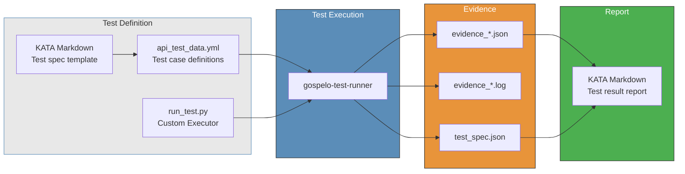
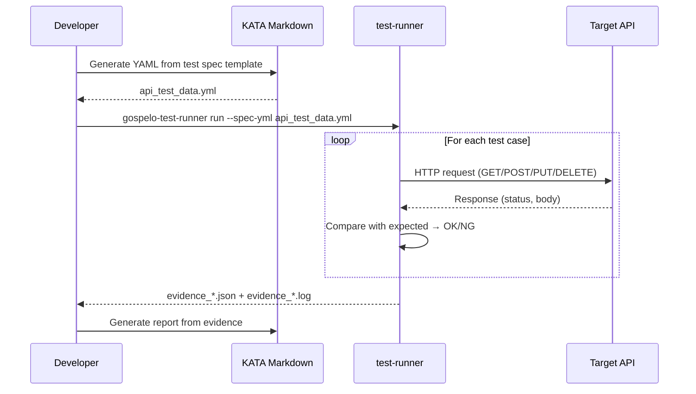
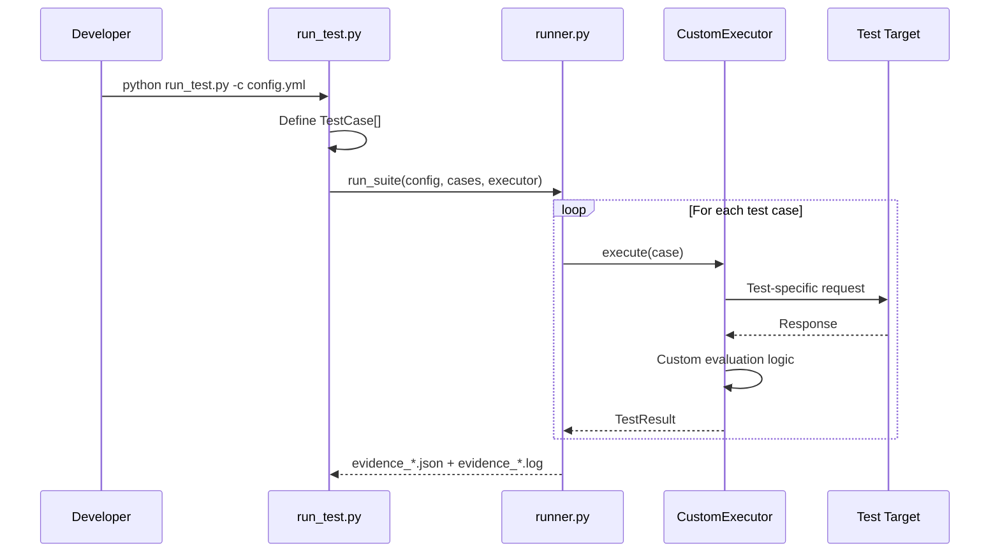
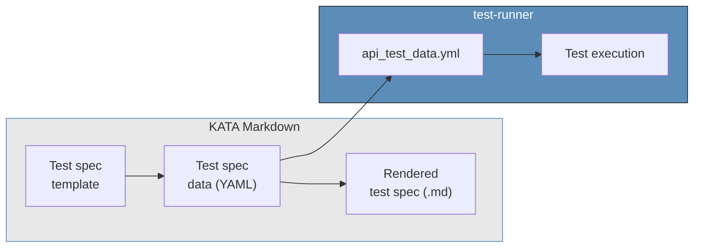
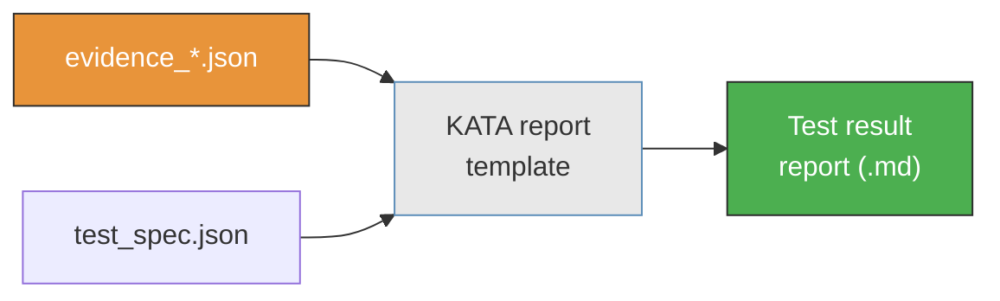
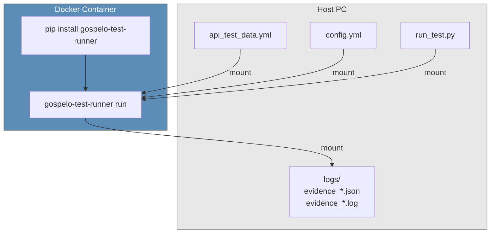

# Use Cases

Use cases achievable with gospelo-test-runner + KATA Markdown.

---

## Use Case Overview



---

## UC1: API Security Testing

Define test cases in YAML and run security tests against APIs using the HTTP Executor.



**Example:**

```bash
# List test cases
gospelo-test-runner run --spec-yml templates/api_test_data.yml --list

# Dry run (verify request contents)
gospelo-test-runner run --spec-yml templates/api_test_data.yml --dry-run

# Execute tests
gospelo-test-runner run --spec-yml templates/api_test_data.yml -c config.yml
```

---

## UC2: Testing with Custom Executors

Subclass `BaseExecutor` in `run_test.py` to implement test-specific logic.



**Examples:**
- CSRF token validation (combined Cookie + Token operations)
- Rate limiting tests (rapid requests with timing measurements)
- Session management tests (login → action → logout flows)
- Infrastructure config verification (SSL certificates, HTTP header inspection)

```python
from gospelo_test_runner import BaseExecutor, TestCase, TestResult, TestStatus

class CsrfExecutor(BaseExecutor):
    def execute(self, case, dry_run=False):
        # 1. Login and obtain CSRF token
        # 2. Send request without token / with invalid token
        # 3. Verify response
        return TestResult(
            test_id=case.test_id,
            status=TestStatus.OK if rejected else TestStatus.NG,
            message="CSRF protection verified",
        )
```

---

## UC3: Test Spec Generation with KATA Markdown

Generate test specification YAML from a KATA Markdown template and feed it directly into the runner.



**Workflow:**

```bash
# 1. Generate data file from KATA template
gospelo-kata assemble --type api_test --data templates/api_test_data.yml

# 2. Render (human-readable test specification)
gospelo-kata render outputs/api_test_spec.kata.md --output outputs/api_test_spec.md

# 3. Run tests using the same YAML
gospelo-test-runner run --spec-yml templates/api_test_data.yml -c config.yml
```

**Key point:** Test specifications (documentation) and test execution (automation) are generated from the **same data source**.

---

## UC4: Partial Execution by Category / Test ID

Run only specific categories or IDs from a large set of test cases.

```bash
# Specific category only
gospelo-test-runner run --spec-yml api_test_data.yml -c config.yml \
  --category "Aurora SQL"

# Specific test ID only
gospelo-test-runner run --spec-yml api_test_data.yml -c config.yml \
  --test-id SI-SQL-01

# Adjust delay between tests (e.g. for rate limiting tests)
gospelo-test-runner run --spec-yml api_test_data.yml -c config.yml \
  --delay 2.0
```

---

## UC5: Evidence Report Generation with KATA Markdown

Feed test execution results (evidence JSON) into a KATA Markdown template to generate reports.



```bash
# After test execution
gospelo-test-runner run --spec-yml api_test_data.yml -c config.yml
# → logs/evidence_20260323_120000.json

# Generate report from evidence (KATA)
gospelo-kata assemble --type test_report \
  --data logs/evidence_20260323_120000.json \
  --output outputs/test_report.kata.md
gospelo-kata render outputs/test_report.kata.md --output outputs/test_report.md
```

---

## UC6: Test Execution in Docker Containers

Run tests inside a Docker container for reproducibility.



```dockerfile
FROM python:3.12-slim
RUN pip install gospelo-test-runner
WORKDIR /tests
ENTRYPOINT ["gospelo-test-runner"]
```

```bash
docker run --rm \
  -v $(pwd)/templates:/tests/templates:ro \
  -v $(pwd)/config.yml:/tests/config.yml:ro \
  -v $(pwd)/logs:/tests/logs \
  gospelo-test-runner \
  run --spec-yml templates/api_test_data.yml -c config.yml
```
