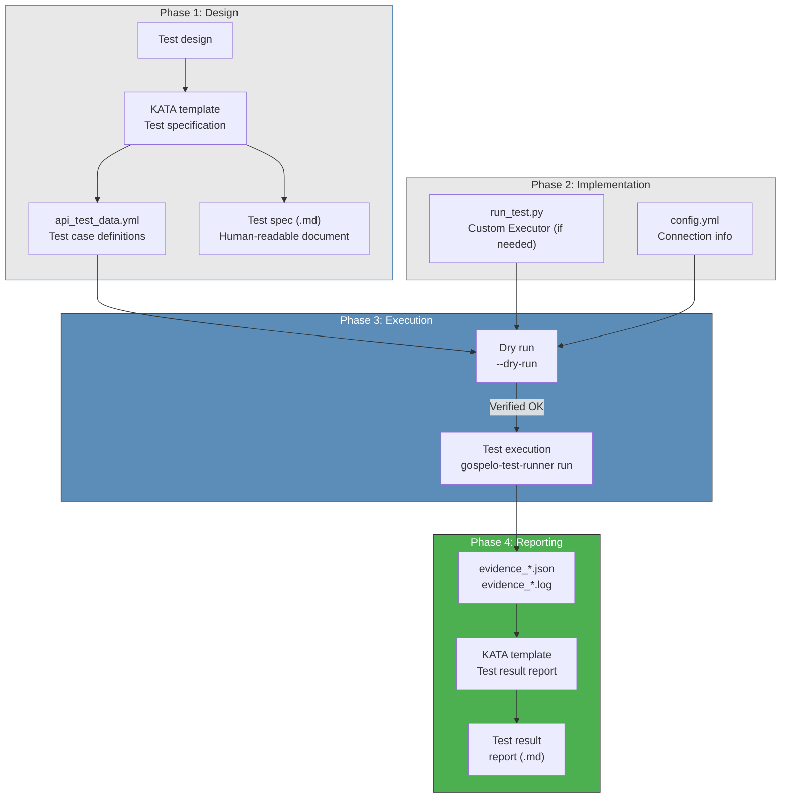
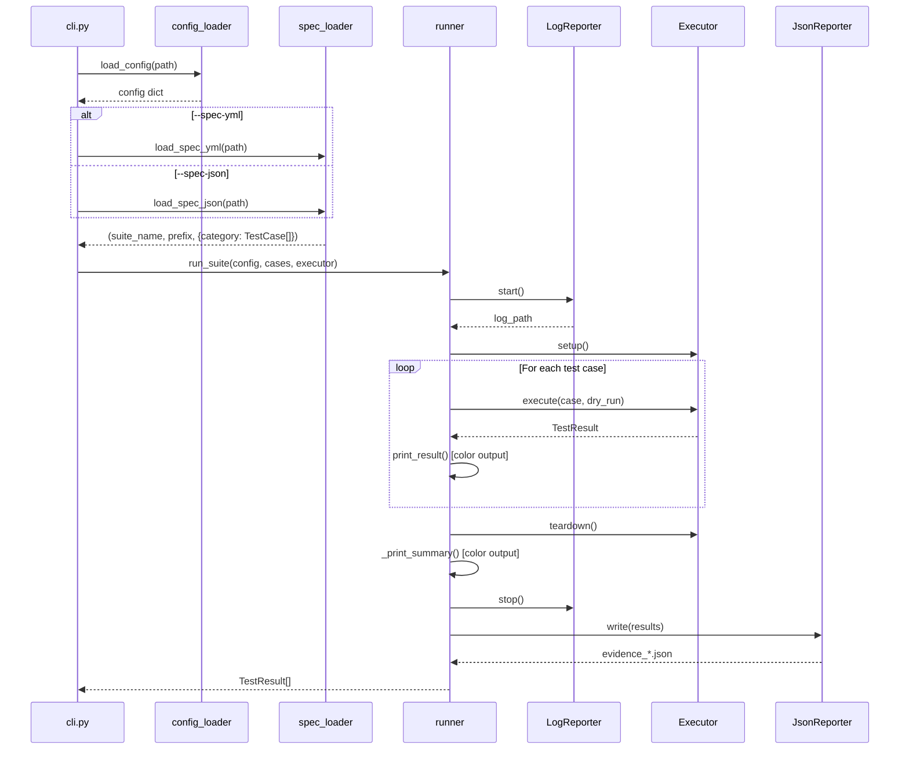
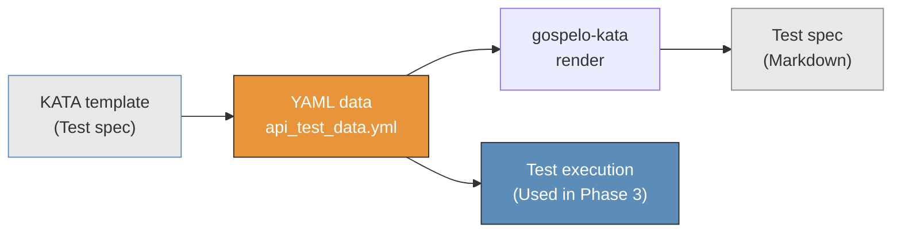
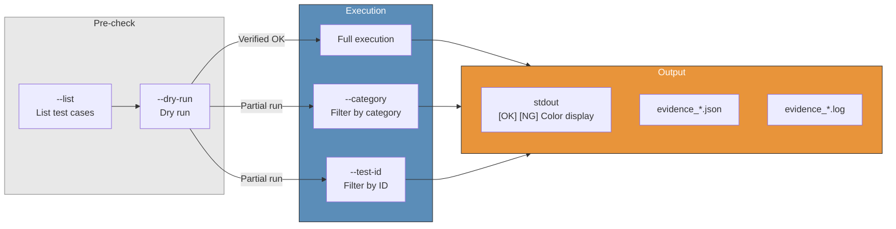
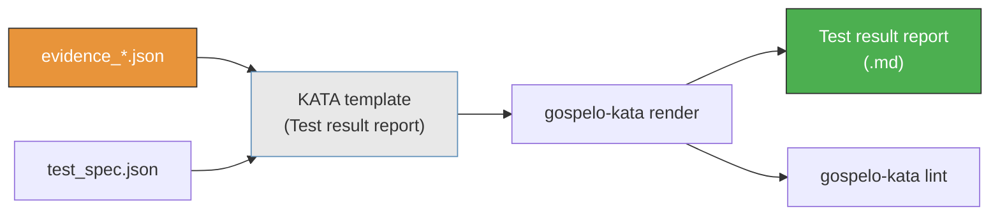
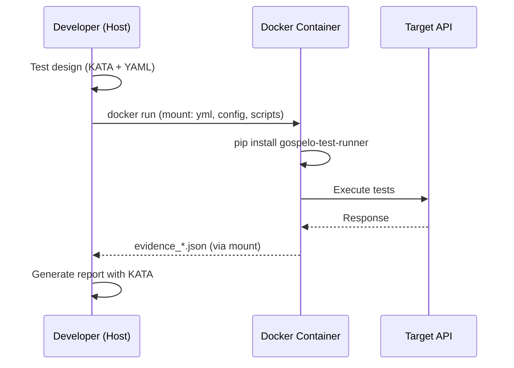

# Workflow

End-to-end testing workflow using gospelo-test-runner + KATA Markdown.

---

## Overall Workflow



---

## Test Execution Flow (Internal Details)



---

## Phase 1: Test Design

Define test specifications using KATA Markdown templates.



```bash
# Create data file from template
gospelo-kata assemble --type api_test --data templates/api_test_data.yml

# Render test specification
gospelo-kata render outputs/api_test_spec.kata.md --output outputs/api_test_spec.md
gospelo-kata lint outputs/api_test_spec.md
```

**Key point:** `api_test_data.yml` serves as the **Single Source of Truth** for both the test specification (for humans) and test execution (for automation).

---

## Phase 2: Test Implementation

### A: YAML Only (when HttpExecutor is sufficient)

```
templates/api_test_data.yml  →  gospelo-test-runner run --spec-yml ...
```

No additional code required. Automated testing using endpoints, methods, and expected statuses defined in YAML.

### B: Custom Executor (when complex test logic is needed)

```python
# run_test.py
from gospelo_test_runner import (
    TestCase, TestResult, TestStatus, TestSuiteConfig,
    BaseExecutor, run_suite, load_config,
)

class MyExecutor(BaseExecutor):
    def execute(self, case, dry_run=False):
        # Test-specific logic
        ...
        return TestResult(test_id=case.test_id, status=..., message=...)

if __name__ == "__main__":
    cases = build_test_cases()
    config = load_config("config.yml")
    suite_config = TestSuiteConfig(test_name="My Test", ...)
    executor = MyExecutor(suite_config)
    results = run_suite(suite_config, cases, executor)
```

---

## Phase 3: Test Execution



```bash
# Step 1: List test cases
gospelo-test-runner run --spec-yml templates/api_test_data.yml --list

# Step 2: Dry run
gospelo-test-runner run --spec-yml templates/api_test_data.yml -c config.yml --dry-run

# Step 3: Execute
gospelo-test-runner run --spec-yml templates/api_test_data.yml -c config.yml

# Partial execution (by category)
gospelo-test-runner run --spec-yml templates/api_test_data.yml -c config.yml \
  --category "Aurora SQL"

# Partial execution (by test ID)
gospelo-test-runner run --spec-yml templates/api_test_data.yml -c config.yml \
  --test-id SI-SQL-01
```

### Execution Output (Color Support)

```
============================================================
  SQL Injection / NoSQL Injection
  2026-03-23 12:00:00
  Cases: 63 / 63
============================================================

--- Aurora SQL Injection ---
  [OK] SI-SQL-01: Vector search - Single quote
  [OK] SI-SQL-02: Vector search - UNION SELECT
  [NG] SI-SQL-03: Vector search - Time-based

============================================================
  Results: 63 total
    [OK] OK: 60
    [NG] NG: 2
    [!!] ERROR: 1
============================================================
```

Color output is automatic on TTY. Automatically disabled when piped or redirected.

---

## Phase 4: Report Generation



```bash
# Export test spec in JSON format (for report generation)
gospelo-test-runner run --spec-yml templates/api_test_data.yml --export-spec

# Generate report with KATA template
gospelo-kata assemble --type test_report \
  --data logs/evidence_20260323_120000.json \
  --output outputs/test_report.kata.md

gospelo-kata render outputs/test_report.kata.md --output outputs/test_report.md
gospelo-kata lint outputs/test_report.md
```

---

## Test Suite Directory Structure

```
tests/{test_id_prefix}/
├── scripts/
│   └── run_test.py              # Test execution script
├── templates/
│   ├── api_test_data.yml        # Test case definitions (YAML)
│   ├── test_spec_data.yml       # Test spec data (for KATA)
│   └── test_prereq_data.yml     # Prerequisite data (for KATA)
├── outputs/
│   ├── test_spec.md             # Rendered test specification
│   ├── test_spec.json           # Exported test spec JSON
│   └── test_report.md           # Test result report
└── logs/
    ├── evidence_*.json          # Test result JSON
    └── evidence_*.log           # Test execution log
```

---

## Docker Workflow



```bash
# Build
docker build -t test-runner .

# Execute
docker run --rm \
  -v $(pwd)/templates:/tests/templates:ro \
  -v $(pwd)/scripts:/tests/scripts:ro \
  -v $(pwd)/config.yml:/tests/config.yml:ro \
  -v $(pwd)/logs:/tests/logs \
  test-runner \
  run --spec-yml templates/api_test_data.yml -c config.yml
```
