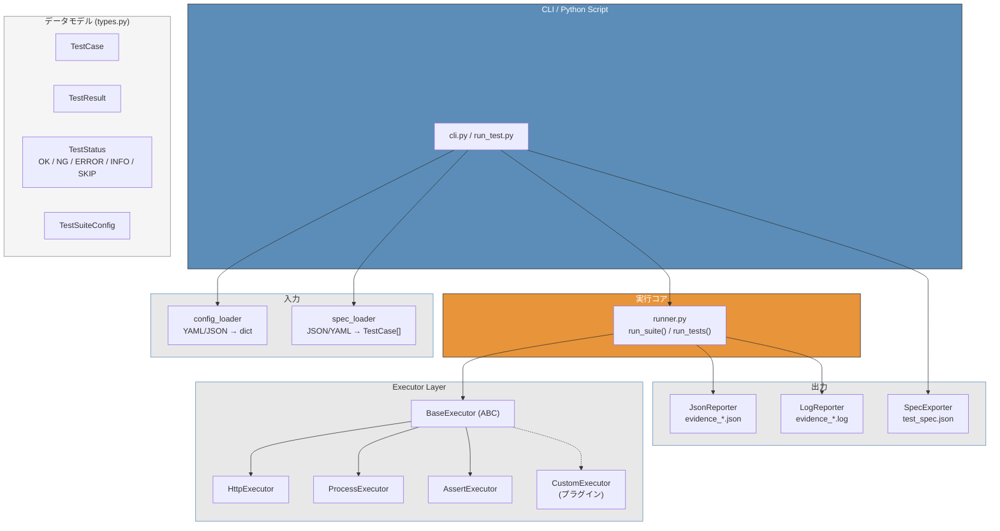
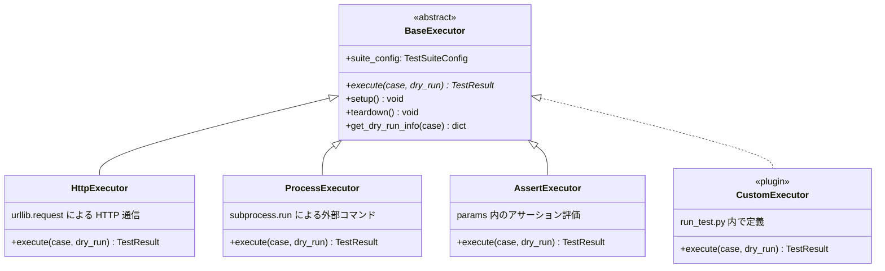
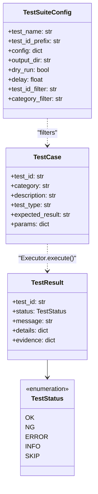

# アーキテクチャ

gospelo-test-runner のパッケージ構成と内部設計。

---

## パッケージ構成

```
gospelo_test_runner/
├── types.py            # TestCase, TestResult, TestSuiteConfig, TestStatus
├── cli.py              # CLI: run / version
├── runner.py           # テスト実行オーケストレーション
├── version.py          # バージョン情報、生成物スタンプ
├── executor/           # テスト実行エンジン (プラグイン)
│   ├── base.py         #   BaseExecutor (ABC)
│   ├── registry.py     #   entry_points プラグイン発見
│   ├── http_executor.py    # HTTP リクエスト実行
│   ├── process_executor.py # サブプロセス実行
│   └── assert_executor.py  # アサーション実行
├── loader/             # 入力データ読み込み
│   ├── config_loader.py    # YAML/JSON 設定ファイル
│   └── spec_loader.py     # テスト仕様 JSON/YAML
└── reporter/           # 出力・レポート生成
    ├── json_reporter.py    # evidence_*.json
    ├── log_reporter.py     # evidence_*.log (stdout キャプチャ)
    └── spec_exporter.py    # TestCase → test_spec.json
```

---

## レイヤー構成



---

## Executor プラグインシステム



組み込み Executor は `entry_points` で登録されており、外部プラグインと同じ仕組みで発見される：

```toml
# pyproject.toml
[project.entry-points."gospelo_test_runner.executors"]
http = "gospelo_test_runner.executor.http_executor:HttpExecutor"
process = "gospelo_test_runner.executor.process_executor:ProcessExecutor"
assert = "gospelo_test_runner.executor.assert_executor:AssertExecutor"
```

`run_test.py` 内で `BaseExecutor` を継承したカスタム Executor を定義するパターンも一般的。

---

## データモデル



---

## 入力フォーマット

### テスト仕様 YAML (`--spec-yml`)

```yaml
suite_name: "テスト名"
base_url: "https://api.example.com"
test_cases:
  - test_id: "XX-01"
    category: "カテゴリ"
    description: "テスト内容"
    method: GET
    endpoint: /api/endpoint
    headers: {}
    params: {}
    body: {}
    expected_status: 400
    expected_body_contains: []
    tags: [tag1]
    priority: medium
    status: draft
```

### テスト仕様 JSON (`--spec-json`)

```json
{
  "test_name": "テスト名",
  "test_id_prefix": "XX",
  "cases": [
    {
      "id": "XX-01",
      "group": "カテゴリ",
      "input": "テスト内容",
      "method": "GET",
      "expected": "期待結果"
    }
  ]
}
```

---

## 出力フォーマット

| ファイル | 生成元 | 内容 |
|---------|-------|------|
| `evidence_*.json` | JsonReporter | テスト結果 (meta + results) |
| `evidence_*.log` | LogReporter | 実行ログ (stdout キャプチャ) |
| `test_spec.json` | SpecExporter | テスト仕様書 (TestCase → JSON) |

---

## 依存関係

- **必須**: Python 3.11+, `pyyaml>=6.0`
- **外部ライブラリ不要**: HTTP 通信は `urllib.request` を使用
