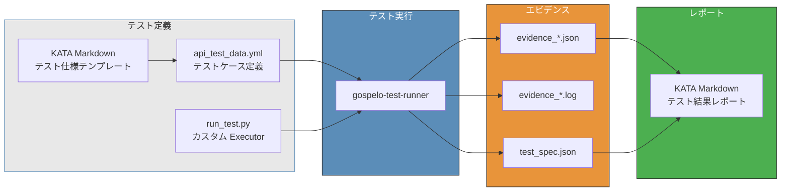
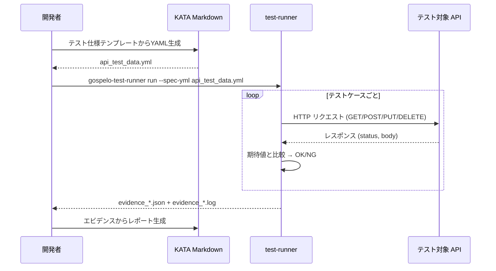
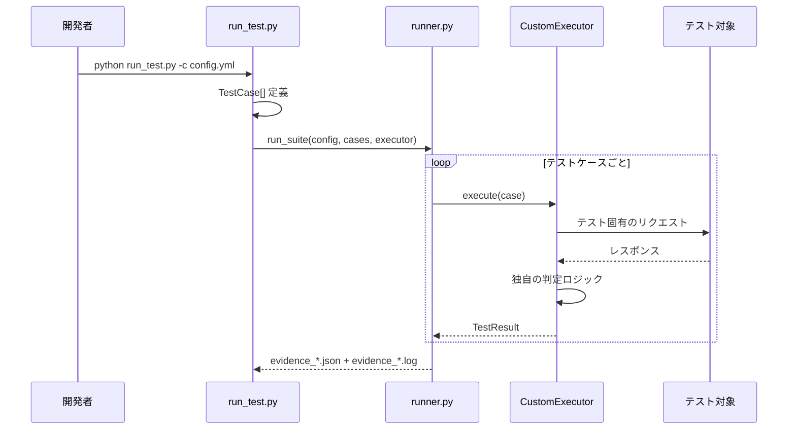
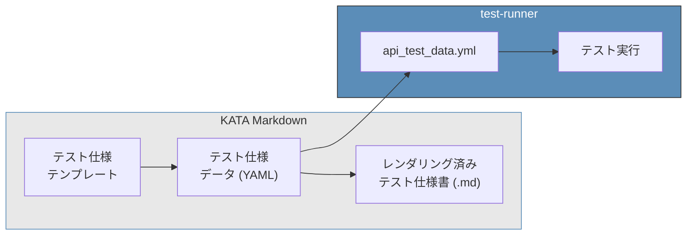
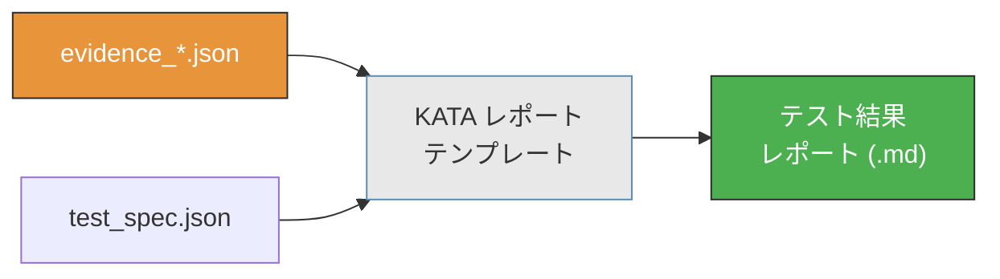
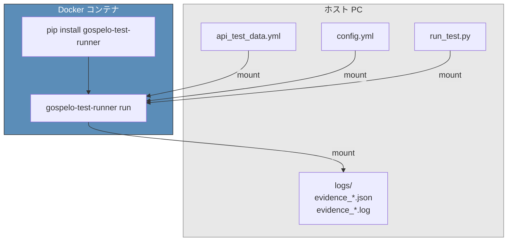

# ユースケース

gospelo-test-runner + KATA Markdown で実現できるユースケース。

---

## ユースケース全体像



---

## UC1: API セキュリティテスト

YAML でテストケースを定義し、HTTP Executor で API に対してセキュリティテストを実行する。



**実行例:**

```bash
# テスト一覧の確認
gospelo-test-runner run --spec-yml templates/api_test_data.yml --list

# ドライラン (リクエスト内容の確認)
gospelo-test-runner run --spec-yml templates/api_test_data.yml --dry-run

# テスト実行
gospelo-test-runner run --spec-yml templates/api_test_data.yml -c config.yml
```

---

## UC2: カスタム Executor によるテスト

`run_test.py` 内で `BaseExecutor` を継承し、テスト固有のロジックを実装する。



**適用例:**
- CSRF トークン検証（Cookie + Token の複合操作）
- レート制限テスト（連続リクエストとタイミング計測）
- セッション管理テスト（ログイン → 操作 → ログアウトのフロー）
- インフラ設定検証（SSL 証明書、HTTP ヘッダー検査）

```python
from gospelo_test_runner import BaseExecutor, TestCase, TestResult, TestStatus

class CsrfExecutor(BaseExecutor):
    def execute(self, case, dry_run=False):
        # 1. ログインして CSRF トークン取得
        # 2. トークンなし/不正トークンでリクエスト
        # 3. レスポンスを検証
        return TestResult(
            test_id=case.test_id,
            status=TestStatus.OK if rejected else TestStatus.NG,
            message="CSRF protection verified",
        )
```

---

## UC3: KATA Markdown によるテスト仕様生成

KATA Markdown テンプレートからテスト仕様 YAML を生成し、そのまま runner に投入する。



**ワークフロー:**

```bash
# 1. KATA テンプレートからデータファイル生成
gospelo-kata assemble --type api_test --data templates/api_test_data.yml

# 2. レンダリング (人間可読なテスト仕様書)
gospelo-kata render outputs/api_test_spec.kata.md --output outputs/api_test_spec.md

# 3. 同じ YAML でテスト実行
gospelo-test-runner run --spec-yml templates/api_test_data.yml -c config.yml
```

**ポイント:** テスト仕様書（ドキュメント）とテスト実行（自動化）が**同じデータソース**から生成される。

---

## UC4: カテゴリ / テストID による部分実行

大量のテストケースから特定のカテゴリやIDだけを実行する。

```bash
# 特定カテゴリのみ
gospelo-test-runner run --spec-yml api_test_data.yml -c config.yml \
  --category "Aurora SQL"

# 特定テストIDのみ
gospelo-test-runner run --spec-yml api_test_data.yml -c config.yml \
  --test-id SI-SQL-01

# テスト間の遅延を調整 (レート制限テスト等)
gospelo-test-runner run --spec-yml api_test_data.yml -c config.yml \
  --delay 2.0
```

---

## UC5: KATA Markdown によるエビデンスレポート生成

テスト実行結果（evidence JSON）を KATA Markdown テンプレートに流し込み、レポートを生成する。



```bash
# テスト実行後
gospelo-test-runner run --spec-yml api_test_data.yml -c config.yml
# → logs/evidence_20260323_120000.json

# エビデンスからレポート生成 (KATA)
gospelo-kata assemble --type test_report \
  --data logs/evidence_20260323_120000.json \
  --output outputs/test_report.kata.md
gospelo-kata render outputs/test_report.kata.md --output outputs/test_report.md
```

---

## UC6: Docker コンテナ内でのテスト実行

テスト実行を Docker コンテナ内に閉じ込め、再現性を確保する。



```dockerfile
FROM python:3.12-slim
RUN pip install gospelo-test-runner
WORKDIR /tests
ENTRYPOINT ["gospelo-test-runner"]
```

```bash
docker run --rm \
  -v $(pwd)/templates:/tests/templates:ro \
  -v $(pwd)/config.yml:/tests/config.yml:ro \
  -v $(pwd)/logs:/tests/logs \
  gospelo-test-runner \
  run --spec-yml templates/api_test_data.yml -c config.yml
```
