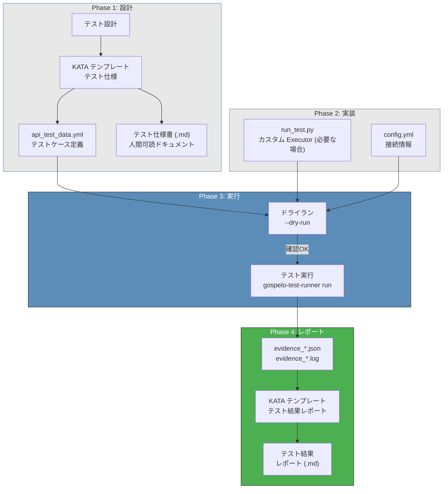
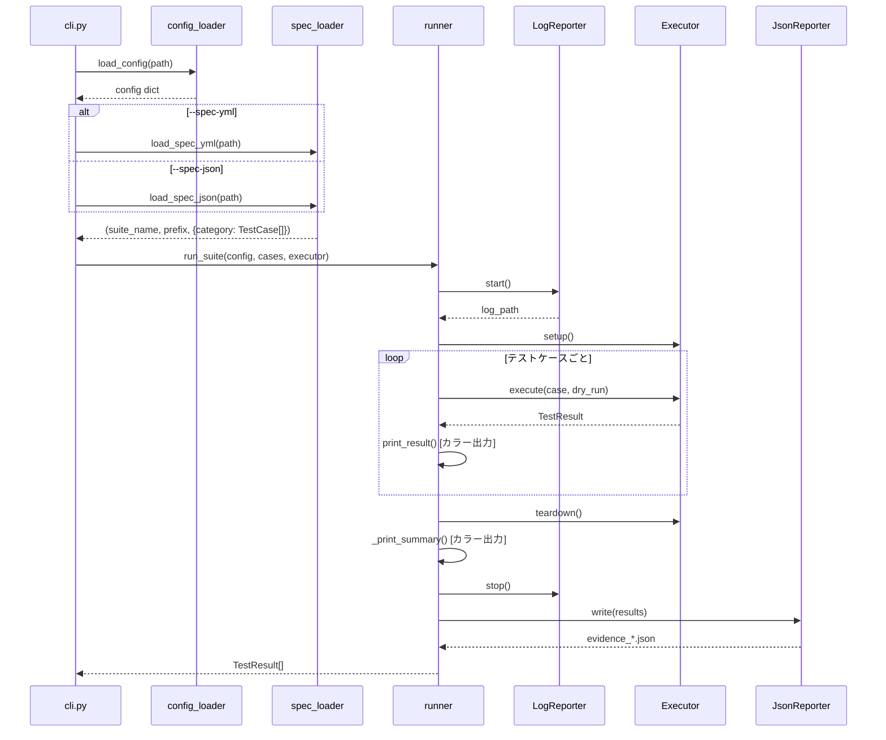
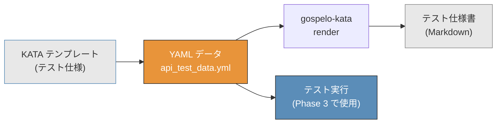
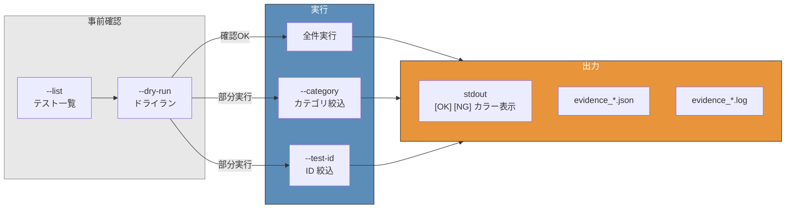
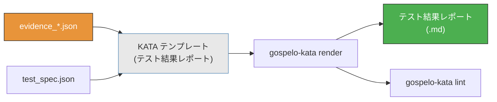
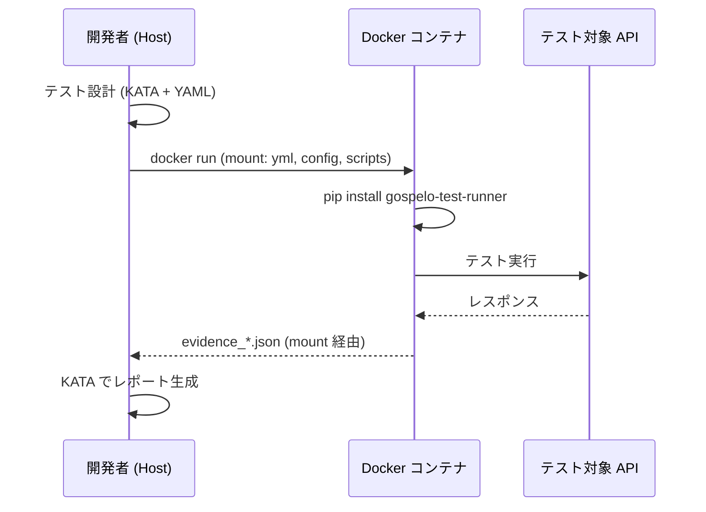

# ワークフロー

gospelo-test-runner + KATA Markdown を使ったテストの全体ワークフロー。

---

## 全体ワークフロー



---

## テスト実行フロー（内部詳細）



---

## Phase 1: テスト設計

KATA Markdown テンプレートを使ってテスト仕様を定義する。



```bash
# テンプレートからデータファイルを作成
gospelo-kata assemble --type api_test --data templates/api_test_data.yml

# テスト仕様書をレンダリング
gospelo-kata render outputs/api_test_spec.kata.md --output outputs/api_test_spec.md
gospelo-kata lint outputs/api_test_spec.md
```

**ポイント:** `api_test_data.yml` がテスト仕様書（人間用）とテスト実行（自動化用）の**Single Source of Truth**。

---

## Phase 2: テスト実装

### A: YAML のみ（HttpExecutor で十分な場合）

```
templates/api_test_data.yml  →  gospelo-test-runner run --spec-yml ...
```

追加のコードは不要。YAML に定義されたエンドポイント、メソッド、期待ステータスで自動テスト。

### B: カスタム Executor（複雑なテストロジックが必要な場合）

```python
# run_test.py
from gospelo_test_runner import (
    TestCase, TestResult, TestStatus, TestSuiteConfig,
    BaseExecutor, run_suite, load_config,
)

class MyExecutor(BaseExecutor):
    def execute(self, case, dry_run=False):
        # テスト固有のロジック
        ...
        return TestResult(test_id=case.test_id, status=..., message=...)

if __name__ == "__main__":
    cases = build_test_cases()
    config = load_config("config.yml")
    suite_config = TestSuiteConfig(test_name="My Test", ...)
    executor = MyExecutor(suite_config)
    results = run_suite(suite_config, cases, executor)
```

---

## Phase 3: テスト実行



```bash
# Step 1: テスト一覧確認
gospelo-test-runner run --spec-yml templates/api_test_data.yml --list

# Step 2: ドライラン
gospelo-test-runner run --spec-yml templates/api_test_data.yml -c config.yml --dry-run

# Step 3: 本番実行
gospelo-test-runner run --spec-yml templates/api_test_data.yml -c config.yml

# 部分実行 (カテゴリ)
gospelo-test-runner run --spec-yml templates/api_test_data.yml -c config.yml \
  --category "Aurora SQL"

# 部分実行 (テストID)
gospelo-test-runner run --spec-yml templates/api_test_data.yml -c config.yml \
  --test-id SI-SQL-01
```

### 実行時の出力（カラー対応）

```
============================================================
  SQLインジェクション / NoSQLインジェクション
  2026-03-23 12:00:00
  Cases: 63 / 63
============================================================

--- Aurora SQLインジェクション ---
  [OK] SI-SQL-01: ベクトル検索 - シングルクォート
  [OK] SI-SQL-02: ベクトル検索 - UNION SELECT
  [NG] SI-SQL-03: ベクトル検索 - タイムベース

============================================================
  Results: 63 total
    [OK] OK: 60
    [NG] NG: 2
    [!!] ERROR: 1
============================================================
```

TTY 出力時に自動でカラー表示。パイプ/リダイレクト時は自動で無効化。

---

## Phase 4: レポート生成



```bash
# テスト仕様をJSON形式でエクスポート (レポート生成用)
gospelo-test-runner run --spec-yml templates/api_test_data.yml --export-spec

# KATA テンプレートでレポート生成
gospelo-kata assemble --type test_report \
  --data logs/evidence_20260323_120000.json \
  --output outputs/test_report.kata.md

gospelo-kata render outputs/test_report.kata.md --output outputs/test_report.md
gospelo-kata lint outputs/test_report.md
```

---

## テストスイートのディレクトリ構成

```
tests/{test_id_prefix}/
├── scripts/
│   └── run_test.py              # テスト実行スクリプト
├── templates/
│   ├── api_test_data.yml        # テストケース定義 (YAML)
│   ├── test_spec_data.yml       # テスト仕様データ (KATA 用)
│   └── test_prereq_data.yml     # 前提条件データ (KATA 用)
├── outputs/
│   ├── test_spec.md             # レンダリング済みテスト仕様書
│   ├── test_spec.json           # エクスポート済みテスト仕様 JSON
│   └── test_report.md           # テスト結果レポート
└── logs/
    ├── evidence_*.json          # テスト結果 JSON
    └── evidence_*.log           # テスト実行ログ
```

---

## Docker でのワークフロー



```bash
# ビルド
docker build -t test-runner .

# 実行
docker run --rm \
  -v $(pwd)/templates:/tests/templates:ro \
  -v $(pwd)/scripts:/tests/scripts:ro \
  -v $(pwd)/config.yml:/tests/config.yml:ro \
  -v $(pwd)/logs:/tests/logs \
  test-runner \
  run --spec-yml templates/api_test_data.yml -c config.yml
```
